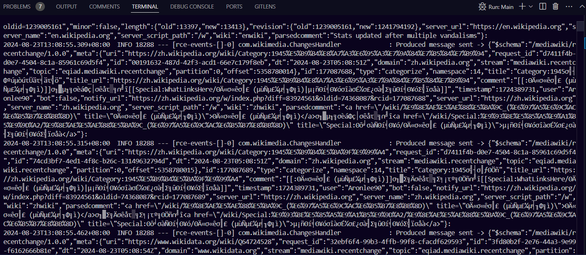
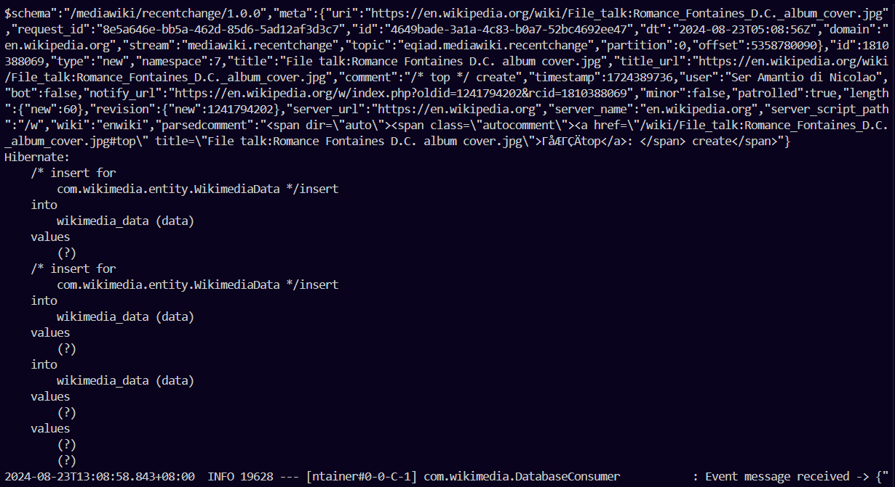

## Kafka using broker architecture


## Setting up Kafka in your local environment

To set up Kafka, follow these steps:

1. Download Kafka: Visit the official Apache Kafka website (https://kafka.apache.org/downloads) and download the latest stable version of Kafka. *(It is recommended to download from `Binary downloads` instead from `Source download` because there seems to have error.)*

2. Extract the downloaded file: Once the download is complete, extract the contents of the downloaded file to a directory of your choice.

3. Start ZooKeeper: Kafka relies on ZooKeeper for coordination. Open a terminal or command prompt and navigate to the Kafka directory. Start ZooKeeper by running the following command:
    
    Windows:
    ```
    bin\windows\zookeeper-server-start.bat config\zookeeper.properties
    ```

    MacOS:
    ```
    bin/zookeeper-server-start.sh config/zookeeper.properties
    ```

4. Start Kafka server: In a new terminal or command prompt, navigate to the Kafka directory and start the Kafka server by running the following command:
    
    Windows:
    ```
    bin\windows\kafka-server-start.bat config\server.properties
    ```

    MacOS:
    ```
    bin/kafka-server-start.sh config/server.properties
    ```

7. After running the API below, you can check Consumer message by opening a new tab in your terminal and run the following command:

    Windows:
    ```
    .\bin\windows\kafka-console-consumer.bat --topic demo_json --from-beginning --bootstrap-server localhost:9092
    ```

    MacOS:
    ```
    bin/kafka-server-start.sh --topic demo_json --from-beginning --bootstrap-server localhost:9092
    ```

8. DO TAKE NOTE: Always start Zookeeper first, followed by Kafka.

## Running the project

1. Make sure to configure your own database url and username using .env file.

kafka-consumer-database/
├── src/
├── .env *(Here)*
├── pom.xml

The database name is `wikimedia` and table name is `wikimedia_data`.

2. Run both producer and consumer to see results.

Logger by Kafka Producer:



Logger by Kafka Consumer:



You should be able to see rows of data created in your table.
